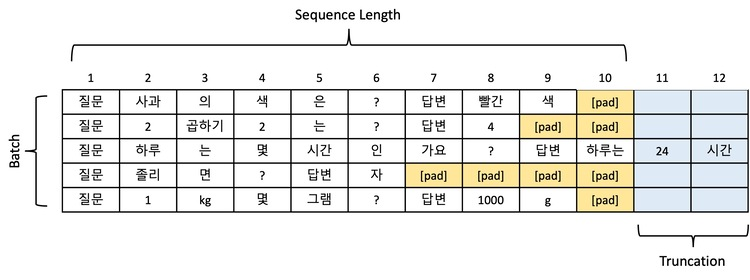
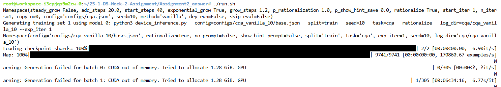
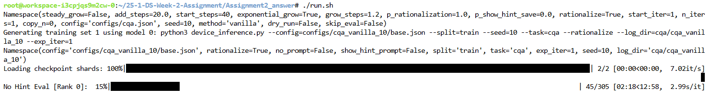
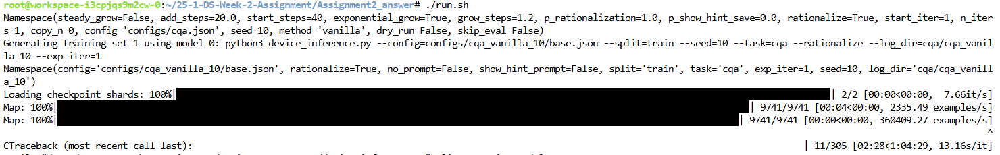

# 25-1-DS-Week-2-Assignment

# Assignment1
	WordPieceTokenizer 구현해보고 기존 BPE와 성능 비교해보기.
	다른 과제처럼 #TODO 부분 구현한 다음 tokenizer_test.py를 실행하여 BPE와의성능비교해보는것이 목표.
## ToDo
	1.우선 make_voca.py를 구현하여 voca.txt를 생성해 주자. (pretrained vocabulary)
    2.그 다음 WordPieceTokenizer.py에서 WordPieceTokenizer를 구현하자.
	3.그 다음 python tests/tokenizer_test.py 를 실행시켜보자. 만약, 아래 Example과 같이 결과가 나온다면 성공!
    4.제출한 github repo에 voab.txt가 있고, 아래 Example과 같은 결과를 캡쳐한 image.png가 repo에 존재하면 통과! 
    -실행 방법은 Runnong Tests 참고. 

## 디렉토리 구조
```bash
Assignment1/
├── src/
│  ├── __init__.py
│  ├── utils.py
│  ├── make_voca.py
│  ├── vocab.txt(make_voca를 통해 생성)
│  └── WordPieceTokenizer.py
└── tests/
    ├── __init__.py
    ├── tests.txt
    ├── image.png(tokenizer_test 결과의 일부분 캡쳐해서 첨부)
    └── tokenizer_test.py

```

## Running Tests

Test the tokenizer against hugging's face implementation:

```bash
pip install transformers
python src/word_piece_tokenizer/make_voca.py
python tests/tokenizer_test.py
```

## Example 

```python
The tree fell unexpectedly short.
[464, 5509, 3214, 25884, 1790, 13]
['[UNK]', 'tree', 'fell', 'unexpectedly', 'short', '##.']

 Performance Results:
BPE tokenizer: 6.458908319473267e-05
This tokenizer: 9.03010368347168e-06
This tokenizer is 86.02% faster
[Average] This tokenizer is 81.31% faster

you are짱 짱짱bye bye
[5832, 389, 168, 100, 109, 23821, 100, 109, 168, 100, 109, 16390, 33847]
['you', '[UNK]', '[UNK]', 'bye']

 Performance Results:
BPE tokenizer: 0.00020454823970794678
This tokenizer: 1.5280209481716156e-05
This tokenizer is 92.53% faster
[Average] This tokenizer is 81.52% faster


```

# Assignment2
max token length를 구하여 LLM 학습 최적화 하기.

## Task (이걸 왜 하는가)


✔ 데이터셋 분포 분석
데이터셋에 긴 문장이 많으면 시퀀스 길이를 늘리고, 짧은 문장이 대부분이라면 줄이는 것이 효율적입니다.
예: 데이터셋의 95%가 1,024 토큰 이하라면, 시퀀스 길이를 1,024로 설정해 리소스를 최적화할 수 있습니다.

✔ 시퀀스와 배치 크기의 균형
긴 시퀀스는 모델 성능을 향상시킬 수 있지만, GPU 메모리 사용량이 늘어나 배치 크기를 줄여야 할 수 있습니다.
따라서 데이터셋의 특성을 보고 시퀀스 길이를 적절히 조절하고 배치를 늘려야 효과적인 학습이 될 수 있습니다.

[출처: https://devocean.sk.com/blog/techBoardDetail.do?ID=167242&boardType=techBlog]

## Task example (이해가 안되면 예시로 대충 파악하자)
❌ gen_length=1024, max_length=2048로 설정했을때: 
    OOM error와 함께, inference하는데 34분이 걸릴예정이라고 뜬다. 정답이 1시간 30분정도 걸리는 것으로 보아, 
    실제로는 몇 시간정도 더 걸릴 것으로 보인다.


❌ gen_length=20, max_length=24 설정했을때: 
    generation이 정상적으로 되는것 처럼 보이며, inference하는데 15분이 걸릴 예정이라고 뜬다. 
    다만 gen_length와 max_length를 너무 작게 설정해서 truncation 문제가 발생할 것이다.



✔ gen_length=true_gen, max_length=true_max 설정했을때: 
    generation이 정상적으로 되는것 처럼 보이며, inference하는데 1시간 5분이 걸릴 예정이라고 뜬다.
    실제 결과 log를 보면 알겠지만 oom도 뜨지 않으면서, truncation error도 발생하지 않는다.  
-결국, 우리가 해야할 것은 log로 나온 데이터의 gen_length와 max_length를 찾아서 true_gen와 true_max에 넣어주는 것이다.


-->> 이번 과제에선 500개의 데이터만 사용하므로, 이정도의 시간이 걸리지는 않는다. 정답기준 5분내외.

-->> 이번 과제의 코드는 LLM의 inference한 결과를 그대로 다른 iteration에서 train data로 사용하는 특수한 케이스에서의 코드다. 따라서 generate한 결과가 매번 다르므로, 사람마다 설정한 값이 다를것이다. 

-->> 그러므로 그냥 calculate_token_length ipynb돌려서 나온 결과를 사진으로 찍고, 
     그 값을 json에 있는 gen_length,max_length에 넣어주면 끝이다.

## ToDo
(사전에 huggingface 계정생성 및 token 생성 및 meta-llama/Llama-3.2-3B 홈페이지에서 모델사용 동의필요.)    
(사전에 vessel 계정생성 및 워크스페이스 생성 필요.) 

0. vessel 혹은 local에서 워크스페이스를 생성 및 실행한다. (vessel의 경우 gpu1으로만 하기.) 
1. git clone https://github.com/MaDoKaLiF/25-1-DS-Week-2-Assignment.git
2. cd 25-1-DS-Week-2-Assignment/Assignment2_problem
3. pip install -r requirements.txt
4. huggingface-cli login & 개인 token 입력
5. chmod +x run.sh
6. ./run.sh 를 실행하여, correct_data.txt를 생성한다.
7. 당연히 위에 나온대로 하면 OOM 에러가 날 것이다.  
8. 때문에, configs에 있는 cqa.json의 gen_length와 max_length값을 적당히 줄여준 다음 다시 ./run.sh 를 실행한다.
9. calculate_token_length.ipynb를 실행하여 적절한 gen_length와 max token length를 구한다.
10. 8번에서 구한 gen_length와 max token length값을 cqa.json 넣어준다.(초기값 수정)
11. calculate_token_length.ipynb를 실행하여 나온 결과값을 캡처하여 github repo에 올려주면, 성공. 

## cqa.json
```
{
    "gen_length": 1024,  <-- OOM
    "max_length": 2084,  <-- OOM
    "model_dir": "checkpoints/",
    "model_name": "meta-llama/Llama-3.2-3B",
    "task": "cqa"
}
```

## 디렉토리 구조
```bash

Assignment2/
├── CommonsenseQA/
│   └── test.json
├── configs/
│   └── cqa.json
├── cqa(main.py를 통해 생성됨)
│	...
│	└── correct_data.txt
├── calculate_token_length.ipynb
├── run.sh
├── main.py
├── utils.py
├── device_inference.py
├── image.png(calculate_token_length 결과 사진 첨부)
└── iteration_train.py
```
## Example 

```
전체 블록 중 최대 토큰 개수 (max token length): 186
전체 블록 중 최대 생성토큰 개수 (gen_length): 125
전체 블록 중 최대 토큰 결과 (max_sentence): The answer must be a place which could be dirty during the big football game. Television (A) would not be something dirty, so it cannot be the answer. Attic (B) and corner (C) would be places which would be dusty, so these two cannot be the answer. Library (D) is also out because we have been told that they cannot clean the corner and library during football matches, so it cannot be the answer. Ground (E) is also out because we cannot clean the ground during the football match, so it cannot be the answer. This leaves the only option: television (A).
```
